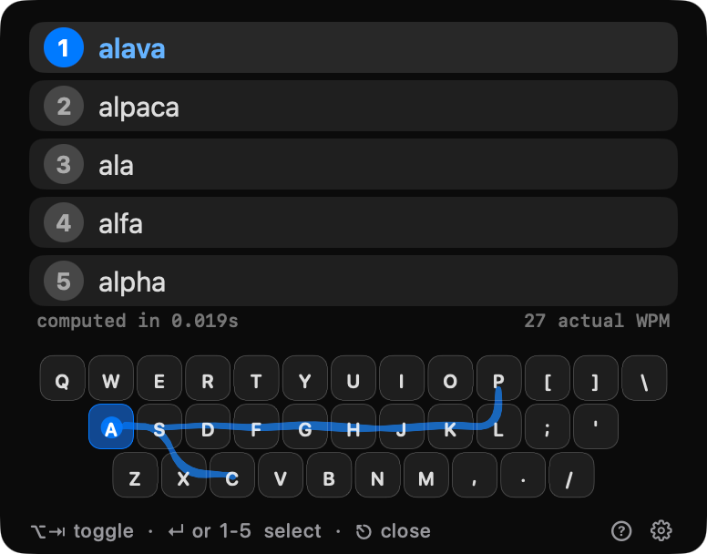
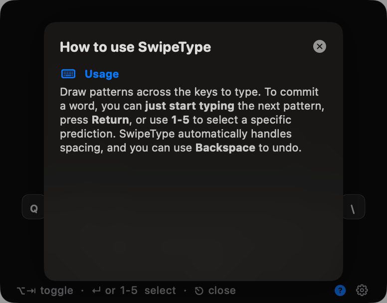
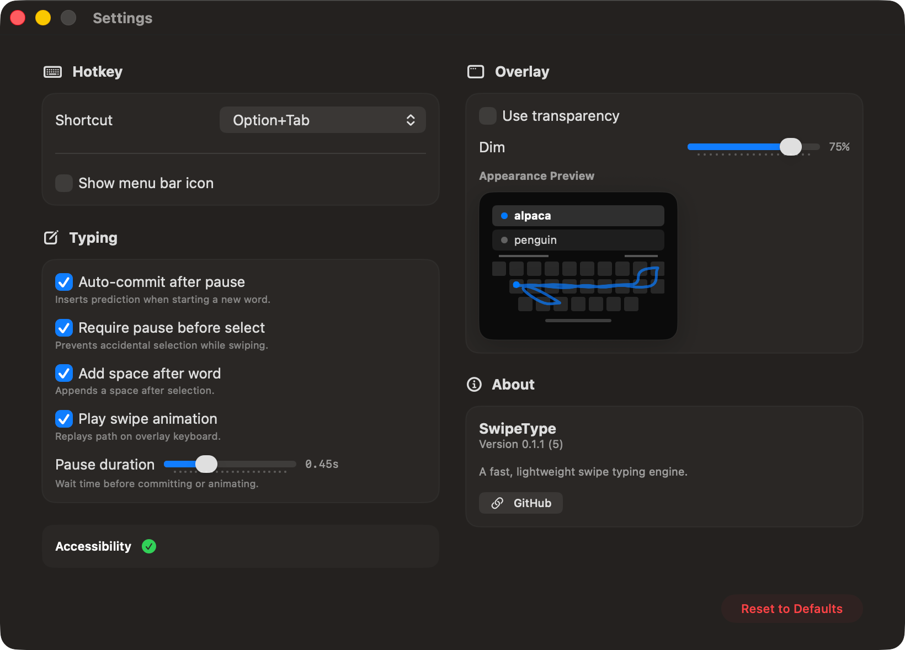

# swipeType

Swipe typing engine and macOS application.

https://github.com/user-attachments/assets/666b0d5c-e7f5-42d0-9504-a1af183c1f8f

- **Rust engine** (`crates/swipe-engine`)
- [Web interface](https://swipetype.zimengxiong.com) (`apps/web`)
- **macOS app** (`apps/mac`)

The engine uses [Dynamic Time Warping (DTW)](https://en.wikipedia.org/wiki/Dynamic_time_warping) to measure similarity between the user's swipe path and pre-computed word paths on a QWERTY keyboard layout. Each word in the dictionary is converted into a series of coordinates based on key positions, and DTW computes a distance score by finding the optimal alignment between two sequences while allowing time warping. To handle 300k+ words efficiently, the engine applies a Sakoe-Chiba band window to constrain DTW to a diagonal band (O(n×w) instead of O(n×m)), maintains O(n) space by keeping only two rows of the matrix, and filters candidates by first/last character to avoid unnecessary comparisons.

## Installation

```bash
brew install zimengxiong/tools/swipetype
```

## Building

<details>
<summary>Rust Engine</summary>

```bash
cd crates/super-swipe-engine

# Build native library
cargo build

# Build WASM for web
cargo build --features wasm

# Build staticlib for macOS
cargo build --release --features ffi
```

```rust
use swipe_engine::{SwipeEngine, Point};

let mut engine = SwipeEngine::new();
engine.load_dictionary("hello\t1000\nworld\t500\n");

let predictions = engine.predict("hello", 5);
// Returns: [(word: String, score: f64, freq: f64), ...]
```

</details>

<details>
<summary>Web</summary>

```bash
make web-build
make web-serve
```

</details>

<details>
<summary>macOS App</summary>

```bash
make mac-dmg
# Creates `apps/mac/build/SwipeType.dmg`
make mac-run
```

</details>

## Screenshots

| Main                          | Help                          |
| ----------------------------- | ----------------------------- |
|  |  |

| Settings                              |
| ------------------------------------- |
|  |
